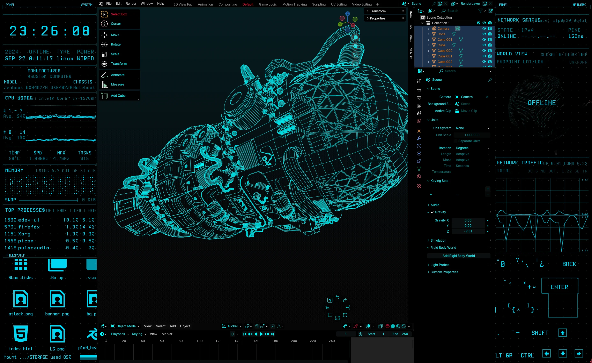
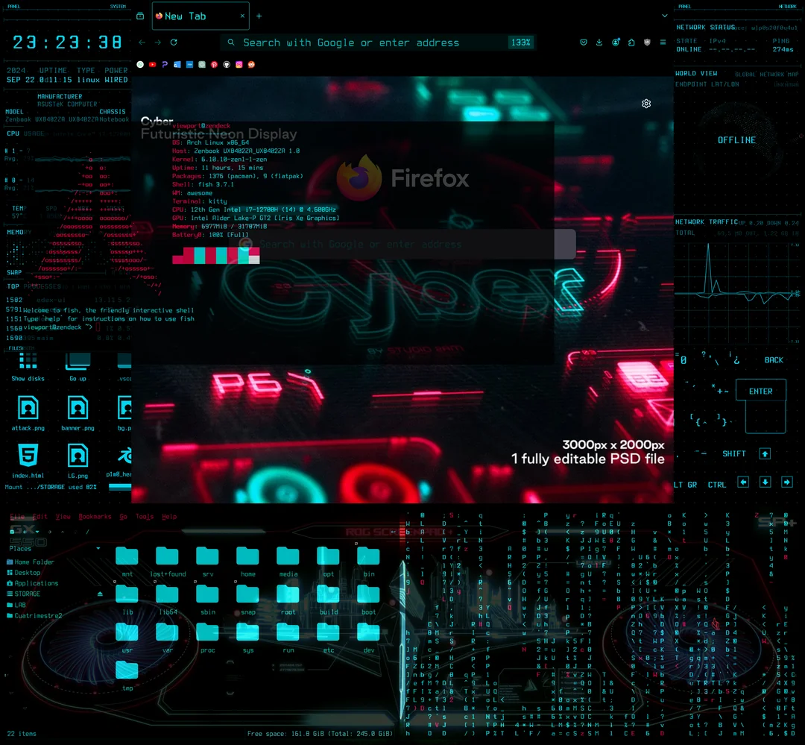

To install, run ./INSTALL.sh (noroot) and follow instructions

*ONLY TESTED IN ARCH LINUX AND DEBIAN 12 (X11)*

If you want to change something after the installation:

AwesomeWM config (key bindings, default apps, window layouts)
> $HOME/.config/awesome/awesome/rc.lua 

Startup file (screens wallpapers, autoexec, display config, touchscreen)
> /usr/bin/startup
